## HTML:
- all the pages in the website got a score of 100 in the accessibility tests when run in the lighthouse extension on Chrome

## CSS:
- extra features added for more readability like changes in colour when hovering over links, and removing underlined from when the link is pressed
- code for this:
/* styling still for links*/
a{
    /* removes the underlining from the links when they are pressed and the relevant page is accessed*/
    text-decoration: none;
    color: #333;
}

/* styling still for links*/
/* specifically for when the mouse hovers over the link*/
li a:hover {
    /* the background colour of the link changes to a darker shade when the user is hovering over it*/
    /*for accessibility and easy selection*/
    background-color: #973856; 
    color: #fff;
}

- but all is commented in the main css file
- also, extra dropdown menu added in the directory-page to help with ease so user knows exactly what operations they can do with the site
- there is css code and html code for this
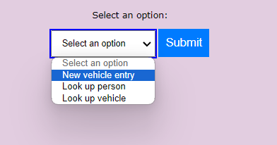
- the css code:
/* the styling for the list of options available in the directory page*/
.actions_dropdown{
    /*placed in the centre of the main as all other text is also in the centre*/
    text-align:center;
    margin-right: 60px; 
    margin-left: 200px;
    flex:1;
    /* has 20px padding just like the main*/
    padding:10px;
}

## Javascript

## People-search-page
- There is an issue with the page not passing the heading test that checks for 'People Search'. Even though the heading is clearly according to the requirements, it still fails the test although I do not understand why. All the headings of all the pages are correct, and this is visible even with this page in the screenshots provided.
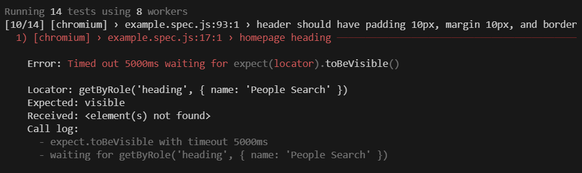

- When I run the test on the people-search-page, it fails and the error is as follows:
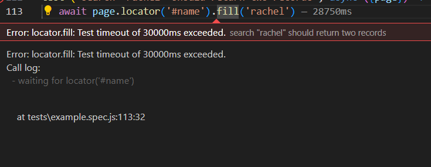
- However, the search successfully returns both rows of data for both instances of the person with the name 'rachel', as shown below:
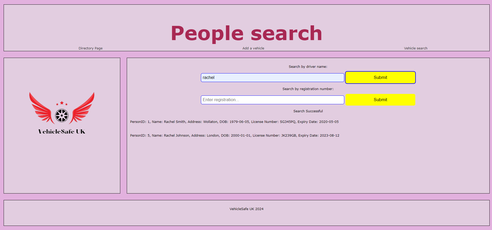
- Also, when you inspect the elements the correct data is returned in the results.
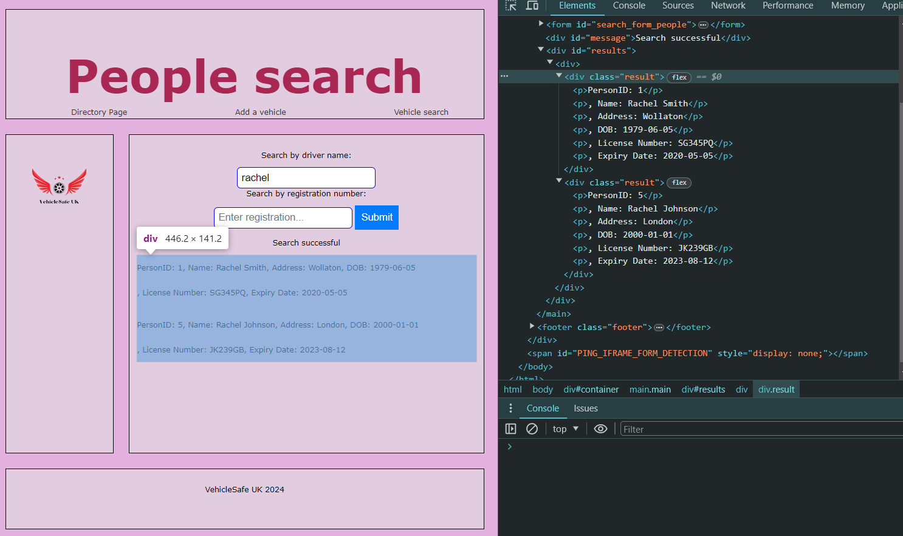
- I am unsure of why this is occuring as the requirements are followed and the results are displayed in the div with id "results". However, there is a possibility that this may be due to my personal internet connection or device, as the query does exactly what it is meant to do as it returns two results and with the correct data for the name 'rachel', and is stored in #results. Additionally, 'Search successful' is printed as required.

## Vehicle-search-page
- The page successfully returns the correct information for the tesla and as it has no user, it displays 'null', as written in the requirements
- However, when the test is run, it fails.
- I am unsure why as the new requirements were added and it functions correctly, so therefore the test should pass.
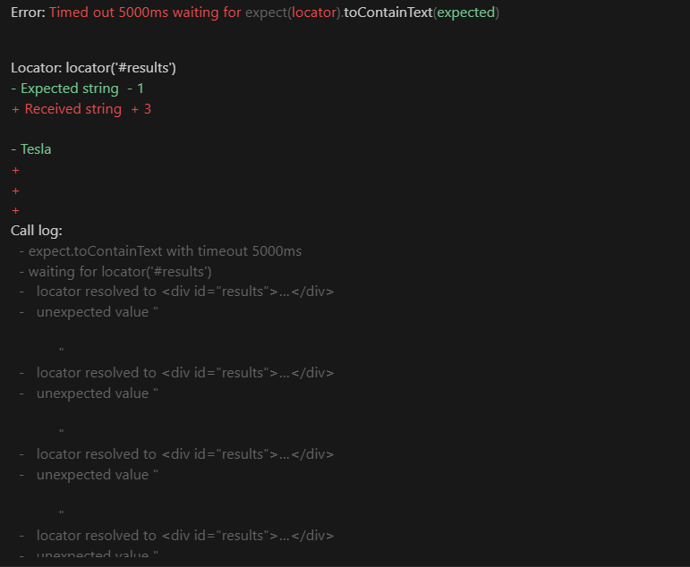
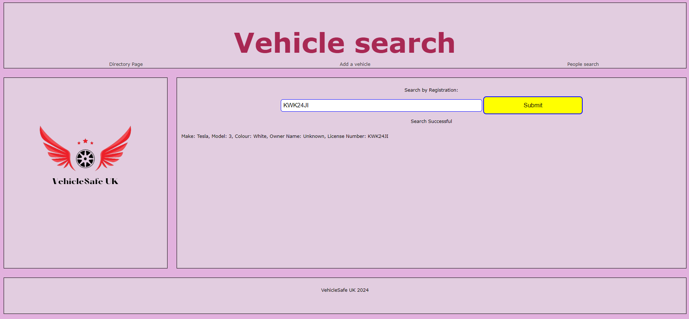
- I have attached another screenshot of proof by inspecting the elements and results of what is printed in #results, specifically looking for the word 'Tesla' and a 'Search succesful message'
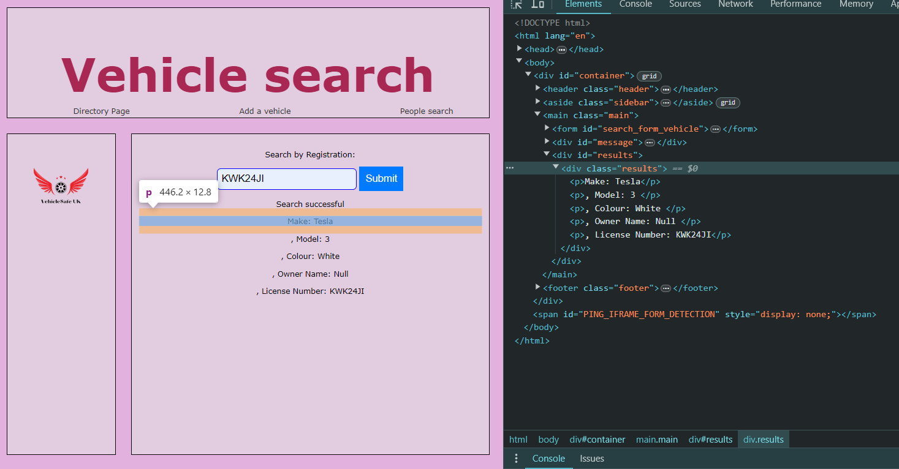

## Registry-page
- Just like the above pages,this page also correctly follows the requirements and functionality required.
- However, the issue that is supposedly causing this is a timeout issue. Image below:

- Below are images of where I have filled out the forms with the data provided in the test exactly as is written there.
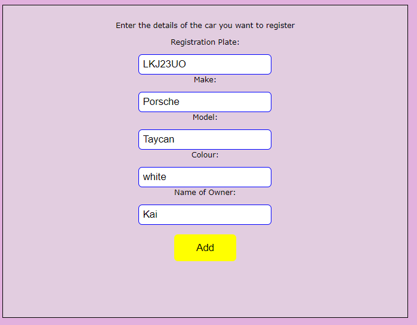
- After this data is submitted, as the user does not exist in the table, the second form for the user to create a new row of data appears and they fill it in:
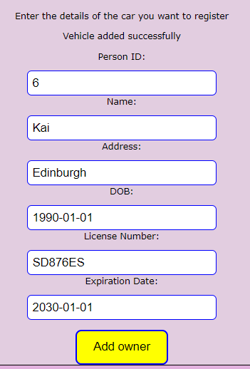
- After the user presses the button labelled with 'Add owner', both the new owner and the new vehicle are added to their respective tables in the database.
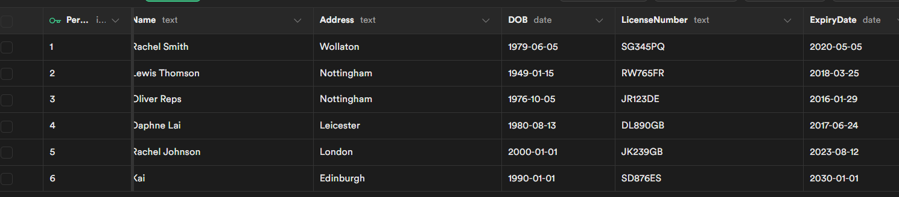
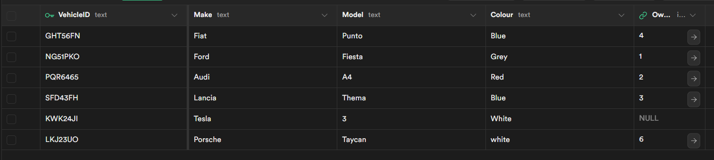

## Extra work
- Prior to the requirements being changed, I completed all the backend calls and requests using manual fetch calls to the API, rather than using the JavaScript client as is now needed.
- Therefore, in my first submission, I submitted the javascript file called 'scripts.js' that uses fetch API to directly establish a conenction to the database. All the functions worked and the pages worked as intended.
- However, I later changed it to use the REST API generated through supabase to fit the updated coursework requirements. This is the final javascript file that has been linked to all the HTML files. It is called 'newscript.js'.
- I have still submitted the original version of the JavaScript as it is extra work that I completed and that still functions.

## Playwright Testing (my tests start on line 162)
- For the last few marks, I have written four tests for the 'Add a vehicle' query page.
- The first test is one where the owner added is a new owner, and therefore the second form must be filled. The user passes the test only if once they submit the second form, the message 'Vehicle added successfully' appears. Just like in the given test above, it then searches for that new person in the People table.

- In the second test, the owner form field is filled with 'Oliver'- who is already in the database. Therefore, the test does not shows the second form. The user passes the test if this owner is looked up in the people search, and the registration number of this newly added vehicle appears in the results.

- In the third test, the effect of missing data on the form is tested, as the 'colour' form field is left blank. Therefore, the user only passes if a message 'Error' is displayed, as the form must check that every form field is filled in before there can be any insertions happening in the database.

- In the fourth test, missing data is added again, but this time in the 'Add Owner' form. Therefore, whilst all form fields are filled in the 'Add vehicle' form, the 'Person ID'  field form in the second form is left empty. The test then searches the #message element to check that the message 'Error' has shown up.